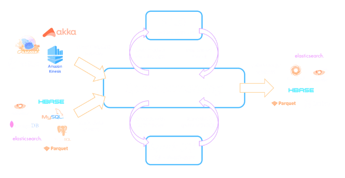
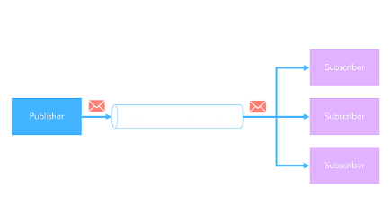
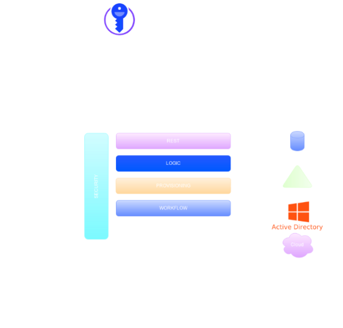
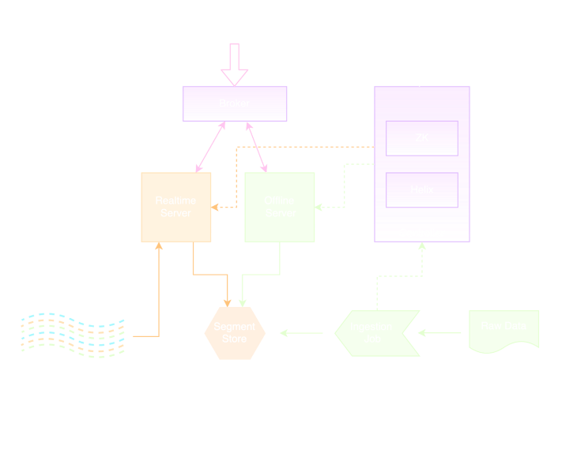

### Universidade Federal de Ouro Preto
##### Disciplina: BCC3 - Sistemas Distribuidos
##### Professor: Carlos Frederico &nbsp; &nbsp; &nbsp; &nbsp; &nbsp; &nbsp; &nbsp; Data: 19/12/2022
##### Alunos: Bernardo Alexandre Santos Emery &nbsp; &nbsp; &nbsp; &nbsp; &nbsp; &nbsp; &nbsp; &nbsp; Matricula: 16.2.5980
#####  &nbsp; &nbsp; &nbsp; &nbsp; &nbsp; &nbsp; &nbsp; &nbsp;Barbara Letícia Rodrigues Milagres &nbsp; &nbsp; &nbsp; &nbsp; &nbsp; &nbsp; &nbsp; Matricula: 18.2.4056
#####  &nbsp; &nbsp; &nbsp; &nbsp; &nbsp; &nbsp; &nbsp; &nbsp;Clara Loris de Sales Gomes  &nbsp; &nbsp; &nbsp; &nbsp; &nbsp; &nbsp; &nbsp; &nbsp; &nbsp; &nbsp; &nbsp; &nbsp; &nbsp; &nbsp;Matricula: 18.2.4004

<hr/>

#### PARTE I

##### EXECUÇÂO

``` bash
docker build -t <USER/IMAGE_NAME> .
docker run -p <PORT>:<PORT> <USER/IMAGE_NAME>
curl localhost:<PORT> -d "hi"
```

<hr />

##### Quais são as direferenças entre EXPOSE e PUBLISH, considerando "docker/dockerfile"?

EXPOSE é uma maneira de declarar e documentar as portas 
que serão usadas. É um atributo opcional.

PUBLSH é uma maneira de mapear as portas da interface 
de rede do container, de forma a libera-la para uso.

<hr />

#### PARTE II

1. Apache Spark:

    O Apache Spark é um mecanismo de sistema distribuído de 
código aberto que oferece suporte ao processamento na 
memória para aumentar o desempenho para processamento 
de dados em grande escala. O Spark processa grandes 
quantidades de dados na memória, o que é muito mais 
rápido do que as alternativas baseadas em disco.

    Muitas empresas estão usando o Spark para ajudar a 
simplificar a tarefa desafiadora e com uso intensivo 
de computação de processamento e análise de grandes 
volumes de dados em tempo real ou arquivados, tanto 
estruturados quanto não estruturados. 

    O Spark tem um conjunto de componentes para solucionar 
problemas específicos, todos construídos sobre o 
Spark Core, que é o componente que disponibiliza 
as funções básicas para o processamento.

    Um conceito importante quando se trata de spark 
é Resilient Distributed Datasets (RDD), que basicamente 
é o objeto principal do modelo de programação do Spark, 
onde os dados serão executados e processados. 

    ARQUITETURA

    Driver Program: aplicação principal que gerencia a 
criação e quem executará o processamento

    Cluster Manager:  é um componente opcional que só é 
necessário se o Spark for executado de forma distribuída. 
É responsável por administrar as máquinas que serão 
utilizadas como workers

    Workers: máquinas que realmente executarão as tarefas 
que são enviadas pelo Driver Program. 

<hr />

2. Apache Spark SQL:

    O componente Apache Spark SQL oferece uma extensão 
    que possibilita a manipulação dos dados utilizando 
    SQL o que facilita o uso da ferramenta para quem
    já está acostumado a manipular dados usando essa 
    linguagem. Spark SQL é o módulo Spark para 
    trabalhar com dados estruturados que oferece 
    suporte a uma maneira comum de acessar uma 
    variedade de fontes de dados. Ele permite consultar 
    dados estruturados dentro de programas Spark, 
    usando SQL ou uma API DataFrame familiar. 

<hr />

3. Apache Spark GraphX:

    O componente Apache Spark GraphX é voltado para o 
    processamento de grafos. Unifica extrair, transformar, 
    carregar e realizar análise exploratória em um 
    único sistema.  Além disso, fornece a capacidade de 
    realizar operações em um multigrafo direcionado com 
    propriedades anexadas a cada vértice e aresta. 
    Utilizando os algoritmos de teoria de grafos que são 
    amplamente utilizados para diversas finalidades, 
    desde redes de computadores, onde os computadores 
    são os vértices e as ligações entre eles são as 
    arestas, até mecanismos de busca e redes sociais, 
    Em que os vértices são as pessoas e as arestas são 
    as relações de amizade. Ela compete em desempenho 
    com os sistemas gráficos mais rápidos, mantendo a 
    flexibilidade, tolerância a falhas e facilidade 
    de uso do Spark.

<hr />

4. Apache Spark MLib:

    É o componente que permite a montagem de aplicações 
    com aprendizado de máquina, com ferramentas que 
    tornam a ML prática escalável e fácil. Foi 
    desenvolvida com base em RDD, que é a estrutura de 
    dados fundamental do Spark. MLlib,  contém muitos 
    algoritmos de aprendizado comuns, como classificação, 
    regressão, recomendação e clustering. Também contém 
    fluxos de trabalho e outros utilitários, incluindo 
    transformações de recursos, construção de pipeline 
    de ML, avaliação de modelo, álgebra linear distribuída 
    e estatísticas. Como os outros componentes de análise 
    de dados unificados do Spark, o MLlib está mudando 
    para APIs baseadas em DataFrames para fornecer mais 
    facilidade no uso e tirar proveito das otimizações 
    do Spark SQL. Além disso, o Apache Spark sempre se 
    mantém atualizado, de modo que bugs e demais 
    problemas são constantemente corrigidos. 

<hr />

5. Apache Spark Stream:

    O Spark Streaming facilita a criação de soluções de 
    streaming escalonáveis e tolerantes a falhas. Ele 
    traz a API integrada à linguagem Spark para o 
    processamento de stream, para que você possa 
    escrever jobs de streaming da mesma forma que os 
    jobs em lote.  Os modelos podem ser treinados 
    offline usando MLlib e, em seguida, usados o
    nline para pontuação de dados de streaming usando 
    o Spark Streaming. Existem mais de 3.000 empresas 
    que usam o Spark Streaming, incluindo empresas 
    como Zendesk, Uber, Netflix e Pinterest. Um 
    mecanismo em tempo real que fornece 
    recomendações de filmes para usuários do Netflix 
    é construído com Kafka e Spark Streaming, que o 
    Netflix usa para lidar com bilhões de eventos 
    por dia de várias fontes.



<hr />

6. Apache Cassandra:

    Cassandra é um banco de dados não relacional, 
    inspirado no DynamoDB. É considerado um banco 
    altamente distribuído, pois cada nó do cluster 
    tem a mesma função, cada nó pode atender a 
    qualquer solicitação. É extremamente tolerante 
    a falhas, pois os dados são replicados 
    automaticamente para vários nós. A replicação 
    em vários data centers é suportada. Nós com 
    falha podem ser substituídos sem tempo de 
    inatividade. Também é altamente escalável, 
    pois foi projetado para ter taxa de 
    transferência de leitura e gravação, aumenta 
    linearmente à medida que novas máquinas são 
    adicionadas, com o objetivo de não haver tempo
    de inatividade ou interrupção nos aplicativos. 
    É extremamente eficiente para escrita, desde 
    que esteja bem modelado. Esse banco não é 
    recomendado em alguns casos, como na situação 
    de um volume de dados muito pequeno.
    É o nono banco de dados mais popular. A Netflix 
    usa Cassandra como seu banco de dados de back-end 
    para seus serviços de streaming, o Discord mudou 
    para o Cassandra em 2015, o Uber usa para 
    armazenar alguns recursos, dentre várias outras 
    grandes empresas.

<hr />

7. Apache Kafka:

    O Apache Kafka é uma plataforma distribuída 
    de transmissão de dados que é usada para
    coletar, processar e armazenar dados de 
    eventos de streaming ou dados que não têm 
    início ou fim distintos. O Kafka coleta 
    dados de streaming e registra exatamente 
    o que aconteceu e quando. Esse registro é 
    chamado de registro de confirmação imutável. 
    É imutável porque pode ser anexado, mas não 
    alterado. Suas grandes vantagens estão na 
    capacidade de escalonamento, velocidade e 
    ser uma plataforma distribuída. Apesar de 
    todas as vantagens do Kafka, ele é uma 
    tecnologia difícil de implantar. Os clusters 
    locais do Kafka são difíceis de configurar, 
    escalonar e gerenciar em produção. Uma 
    abordagem alternativa é utilizar o Kafka 
    como um serviço gerenciado na nuvem. Um 
    fornecedor terceirizado cuida do 
    provisionamento, da criação e manutenção da 
    infraestrutura do Kafka. Você cria e executa 
    os aplicativos.

<hr />

8. RabbitMQ:

    RabbitMQ é um servidor de mensageria de 
    código aberto desenvolvido implementado 
    para suportar mensagens em um protocolo 
    denominado Advanced Message Queuing 
    Protocol (AMQP). Ele possibilita lidar 
    com o tráfego de mensagens de forma 
    rápida e confiável, além de ser compatível 
    com diversas linguagens de programação, 
    possuir interface de administração nativa 
    e ser multiplataforma.

    Dentre as aplicabilidades do RabbitMQ 
    estão possibilitar a garantia de 
    assincronicidade entre aplicações, 
    diminuir o acoplamento entre aplicações, 
    distribuir alertas e controlar filas de 
    trabalhos. Muito utilizado por quem 
    trabalha com comunicação entre sistemas. 
    Operando de forma assíncrona, ele age 
    como um intermediário que processa as 
    nossas mensagens entre produtores e 
    consumidores.

<hr />

9. Redis Pub/Sub:

    Redis é um banco de dados in-memory e 
    open-source, usado geralmente como cache 
    ou como message broker, como o RabbitMQ.
    Ele fornece estruturas de dados como 
    strings, hashes, listas, conjuntos, 
    conjuntos ordenados, bitmaps, índices 
    geoespaciais, streams, entre outros. 
    Apesar de ser muito associado como banco
    em memória, Redis tem diferentes níveis 
    de persistência, transações, replicação
    e permite fazer clusterização. E apesar
    de ser muito associado a estruturas 
    chave-valor, ele permite uma grande gama
    de operações diferentes do que apenas 
    consultar e armazenar baseado em chaves.

    O Pub/Sub representa a relação 1:n, onde 
    temos um único publisher (alguém que 
    recebe e registra as requisições no canal) 
    e vários subscribers (destinatários ou 
    workers diferentes) que estão esperando 
    por mensagens.




<hr />

10. MongoDB notification usando realm:

    O Realm Database é executado diretamente 
    em dispositivos cliente. O acesso de objetos 
    é feito usando a linguagem de consulta 
    nativa para cada plataforma. Armazenar, 
    acessar e atualizar seus dados é simples e 
    leve. O Realm Database é off-line primeiro, 
    ou seja, sempre lê e grava no banco de dados 
    local, não pela rede. Quando o Device Sync 
    está habilitado, o Realm Database sincroniza 
    os dados com o App Services pela rede em um 
    thread em segundo plano. O protocolo de 
    sincronização resolve conflitos de forma 
    consistente em cada cliente e no cluster 
    Atlas vinculado. Os Realm SDKs usam o Atlas
    Device Sync para sincronizar dados de 
    aplicativos entre clientes e Atlas MongoDB. 
    O Atlas Device Sync lida com o acesso à 
    rede e a resolução de conflitos em um thread 
    em segundo plano do aplicativo, para que a 
    lógica do aplicativo permaneça o mesmo,
    independentemente das condições da rede. 
    Além disso, o Realm Database possui 
    Interface do usuário reativa.

<hr />

11. Apache Ignite:

    Apache Ignite é um sistema de gerenciamento 
    de banco de dados distribuído para computação
    de alto desempenho. O banco de dados do 
    Apache Ignite utiliza a RAM como a camada 
    padrão de armazenamento e processamento, 
    pertencendo assim à classe de plataformas de 
    computação na memória. A camada de disco é 
    opcional, mas, uma vez habilitada, manterá o 
    conjunto de dados completo, enquanto a camada
    de memória armazenará em cache o conjunto de 
    dados total ou parcial, dependendo de sua 
    capacidade. Os dados no Ignite são armazenados 
    na forma de pares chave-valor. O componente de 
    banco de dados distribui pares chave-valor pelo 
    cluster de tal forma que cada nó possua uma 
    parte do conjunto de dados geral. Os dados são 
    reequilibrados automaticamente sempre que um nó 
    é adicionado ou removido do cluster. O cluster 
    Apache Ignite pode ser implantado no local em 
    um hardware de mercadoria, na nuvem ou em 
    ambientes conteinerizados e de provisionamento.

<hr />

12. Apache JMeter:

    O JMeter é atualmente a ferramenta de teste de 
    desempenho mais apreciada do mundo. Ele tem 
    uma ampla gama de recursos e uma comunidade de
    usuários considerável que o suporta.

    - Ele está disponível em uma plataforma de 
    código aberto e pode ser usado para testes 
    de carga (acesso de vários usuários aos 
    serviços da Web simultaneamente) e testes 
    de estresse (carga máxima que o servidor da 
    Web pode manipular).

    - O Apache Jmeter suporta multithreading e 
    oferece uma interface simples para organizar 
    e criar sequências de teste de desempenho.

    - Suporta uma variedade de servidores e 
    protocolos: Capaz de fazer testes de 
    desempenho e carga em uma variedade de 
    servidores e navegadores, incluindo 
    Web - HTTP, HTTPS, SOAP, banco de dados
    via JDBC, LDAP, JMS, mail - POP3, SMTP,
    e etc.

    - O Jmeter também é bastante expansível e, 
    portanto, compatível com vários plug-ins e 
    integrações de terceiros.

    - Ele testa o desempenho de recursos estáticos 
    (JavaScript e HTML) e dinâmicos (JSP, Servlets 
    e AJAX).

    - Os administradores de sistema também podem 
    usá-lo para testar a funcionalidade do hardware,
    como o desempenho do servidor ou a velocidade 
    da rede.

    - Você pode criar relatórios de desempenho 
    personalizados e exportar suas informações de 
    desempenho para arquivos CSV.

    - Ele permite que você colete e analise 
    estatísticas de desempenho e um modelo e simule 
    interações complicadas na web.

    - Ele também ajuda a identificar, abordar e 
    evitar problemas de desempenho com seus 
    aplicativos e serviços Web.

<hr />

13. Google Pub/Sub:

    O Pub/Sub é um serviço de mensagens em tempo 
    real totalmente gerenciado que permite o envio 
    e o recebimento de mensagens entre aplicativos 
    independentes. O Pub/Sub permite que os serviços 
    se comuniquem de forma assíncrona, com latências 
    de 100 milissegundos.
    
    O Pub/Sub é usado na análise de streaming e em 
    pipelines de integração para processar e distribuir 
    dados. Isso é igualmente eficaz como um middleware 
    orientado a mensagens para integração de serviços 
    ou como uma fila para carregar tarefas em paralelo.
    Seus principais recursos são:

    - Análises de stream e conectores: A integração 
    nativa do Dataflow permite o processamento e a 
    integração confiáveis, expressivos e exatos dos 
    fluxos de evento em Java, Python e SQL.

    - Entrega em ordem e em escala: A ordem opcional 
    por chave simplifica a lógica dos aplicativos com
    estado sem sacrificar o escalonamento horizontal; 
    não há a necessidade de partições.

<hr />

14. Apache Syncop:

    Apache Syncope é um sistema de código aberto para 
    gerenciar identidades digitais em ambientes 
    corporativos. Abaixo é apresentada sua arquitetura.

    


    - **Keymaster** permite a descoberta dinâmica de serviços 
    para que outros componentes possam se encontrar.

    - **Admin UI** é o console baseado na Web para configurar 
    e administrar implantações em execução, com suporte 
    total para administração delegada.

    - **Admin UI** é o aplicativo baseado na Web para 
    autoregistro, autoatendimento e redefinição de
    senha.

    - **Web Access** é o componente Gerenciamento de Acesso, 
    baseado no CAS do Apereo.

    - **Secure Remote** Access permite proteger aplicativos 
    herdados integrando-se ao Web Access ou a outros 
    terceiros Gerenciadores de acesso implementando 
    protocolos padrão como OpenID Connect ou SAML.

    - **Core** é o componente central, fornecendo todos os 
    serviços oferecidos pelo Apache Syncope.
    Ele expõe uma interface RESTful JAX-RS 2.1 totalmente 
    compatível que permite que aplicativos de terceiros, 
    escritos em qualquer linguagem de programação, 
    consumam IdM Serviços.

    - **Logic** implementa a lógica de negócios geral que 
    pode ser acionada por meio de serviços REST e controla 
    alguns recursos adicionais (notificações, relatórios e
    auditoria em geral).

    - **Provisioning** está envolvido com o gerenciamento
    interno (via fluxo de trabalho) e externo (via conectores 
    específicos) representação de usuários, grupos e 
    quaisquer objetos. Esse componente geralmente precisa ser 
    adaptado para atender aos requisitos de uma implantação 
    específica, pois é o ponto de decisão crucial para
    definir e impor a consistência e as transformações entre 
    o interior e o dados externos. A implementação padrão 
    totalmente Java pode ser estendida para essafinalidade.

    - **Workflow** é um dos aspectos conectáveis do Apache 
    Syncope: isso permite que cada implantação escolha o 
    preferido de uma lista fornecida - incluindo a baseada
    no Flowable BPM, a implementação de referência do BPMN
    2.0 de código aberto - ou definir novos e personalizados.

    - **Persistence** gerencia todos os dados (usuários, 
    grupos, atributos, recursos, ...) em um alto nível 
    usando uma abordagem JPA 2.2 padrão. Os dados são 
    persistidos em um banco de dados subjacente, 
    conhecido como Internal Storage. A consistência é
    assegurada através da gestão abrangente de 
    transações fornecida pelo Spring Framework. 
    Globalmente, isso oferece a capacidade de escalar 
    facilmente até um milhão de entidades e, ao mesmo 
    tempo, permite grandes portabilidade sem alterações 
    de código: MySQL, MariaDB, PostgreSQL, Oracle e 
    MS SQL Server são totalmente suportados opções de 
    implantação. Os domínios permitem gerenciar dados 
    pertencentes a diferentes locatários em instâncias 
    de banco de dados separadas.

    - **Security** define um conjunto refinado de 
    direitos que podem ser concedidos aos administradores, 
    permitindo assim a implementação de cenários de 
    administração delegada.

<hr />

15. Apache Pinot:

    O Apache Pinot é um armazenamento de dados 
    distribuído, de código aberto e orientado a
    colunas, escrito em Java. O Pinot foi 
    projetado para executar consultas OLAP com 
    baixa latência. É adequado em contextos em 
    que são necessárias análises rápidas, como 
    agregações, em dados imutáveis, possivelmente,
    com ingestão de dados em tempo real. 

    A sua arquitetura é apresentada abaixo:

    

    O Pinot usa o Apache Helix para gerenciamento 
    de clusters. O Helix é incorporado como um 
    agente nos diferentes componentes e usa o 
    Apache ZooKeeper para coordenação e manutenção 
    do estado geral e da integridade do cluster.
    Todos os servidores e corretores Pinot são 
    gerenciados pela Helix. Helix é uma estrutura 
    genérica de gerenciamento de cluster para 
    gerenciar partições e réplicas em um sistema 
    distribuído.

    **Gerenciamento de consultas**
    <br />
    As consultas são recebidas por brokers — que 
    verifica a solicitação em relação à tabela de 
    roteamento de segmento para servidor — 
    espalhando a solicitação entre servidores em 
    tempo real e offline.

    **Gerenciamento de clusters**
    <br />
    O Pinot aproveita o Apache Helix para 
    gerenciamento de clusters. Helix é uma 
    estrutura de gerenciamento de cluster para 
    gerenciar recursos replicados e particionados 
    em um sistema distribuído. A Helix usa o 
    Zookeeper para armazenar o estado e os 
    metadados do cluster.

<hr />

16. AWS SNS:

    O Amazon Simple Notification Service (SNS) 
    envia notificações de duas maneiras, A2A e
    A2P. A maneira A2A fornece um sistema de 
    mensagens com alto throughput e baseado em
    push para mensagens entre diversos sistemas 
    distribuídos, microsserviços e aplicações
    com tecnologia sem servidor orientadas a 
    eventos. Essas aplicações incluem o Amazon
    Simple Queue Service (SQS), o Amazon Kinesis 
    Data Firehose, o AWS Lambda e outros endpoints 
    HTTPS. A funcionalidade A2P, por sua vez, 
    permite o envio de mensagens para seus 
    clientes utilizando textos SMS, notificações 
    por push e e-mail.

<hr />

17. RPC e gRPC:

    A ideia base do gRPC era ser muito mais 
    performático do que a sua contraparte ReST 
    por ser baseado no HTTP/2 e utilizar uma 
    Linguagem de Definição de Interfaces (IDL)
    conhecida como Protocol Buffers (protobuf). 
    Este conjunto de ferramentas torna possível
    que o gRPC seja utilizado em diversas 
    linguagens ao mesmo tempo com um overhead
    muito baixo enquanto continua sendo mais 
    rápido e mais eficiente do que as demais
    arquiteturas de chamadas de rede. Além 
    disso, a chamada de um método remoto é,
    essencialmente, uma chamada comum de um 
    método local, que é interceptada por um
    modelo local do objeto remoto e 
    transformada em uma chamada de rede, ou 
    seja, você está chamando um método local 
    como se fosse um método remoto.

<hr />


#### Referências

https://docs.mongodb.com/realm/tutorial

https://www.mongodb.com/docs/realm/introduction/

https://en.wikipedia.org/wiki/Apache_Ignite

https://ignite.apache.org/

https://jmeter.apache.org

https://geekflare.com/apache-jmeter-guide/

https://cloud.google.com/pubsub?hl=pt-br

https://gabriel-faraday.medium.com/google-cloud-pub-sub-o-que-é-como-funciona-cbf70c5edb66

https://cloud.google.com/pubsub/docs/overview?hl=pt-br

http://syncope.apache.org/

https://pinot.apache.org/

https://en.wikipedia.org/wiki/Apache_Pinot

https://www.luiztools.com.br/post/arquitetura-assincrona-pubsub-com-redis-nodejs/

https://cloud.google.com/pubsub/docs/overview?hl=pt-br

https://en.wikipedia.org/wiki/RabbitMQ

https://cloud.google.com/learn/what-is-apache-kafka?hl=pt-br

https://www.redhat.com/pt-br/topics/integration/what-is-apache-kafka

https://cassandra.apache.org/_/index.html

https://www.projectpro.io/article/spark-streaming-example/540

https://medium.com/data-hackers/introdu%C3%A7%C3%A3o-ao-spark-graphx-e-graphframes-9b10089f2e7f

https://learn.microsoft.com/pt-br/dotnet/spark/what-is-spark

https://cloud.google.com/learn/what-is-apache-spark?hl=pt-br

https://www.devmedia.com.br/introducao-ao-apache-spark/34178

https://www.devmedia.com.br/apache-spark-trabalhando-com-sql-em-aplicacoes-big-data/34251

https://aws.amazon.com/sns/

https://blog.lsantos.dev/guia-grpc-1/


